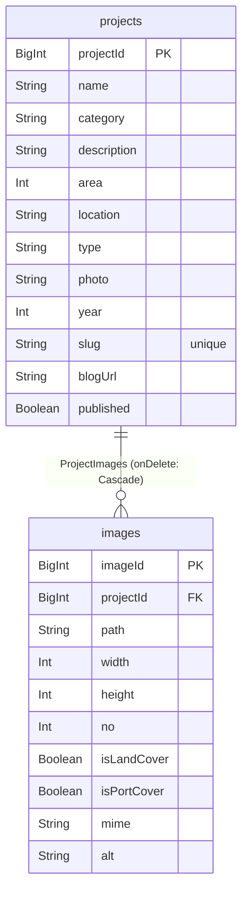

<div align="center">
  
  <h1>DEEF — Interior Studio Portfolio</h1>
  <p>인테리어 스튜디오 포트폴리오 웹사이트</p>
  <p>
    <a href="https://deef.kr" target="_blank"><b>🔗 deef.kr</b></a> ·
    <a href="https://github.com/leedaye0412/deef" target="_blank"><b>📦 Repo</b></a>
  </p>
  
  
  
  
  
  
  
</div>

---

## 목차
1. [프로젝트 소개](#프로젝트-소개)
2. [개발 동기](#개발-동기)
4. [기술 스택 및 선택 이유](#기술-스택-및-선택-이유)
5. [주요 기능](#주요-기능)
6. [아키텍처 & 데이터 모델](#아키텍처--데이터-모델)
7. [프로젝트 구조](#프로젝트-구조)
8. [SEO & 성능 전략](#seo--성능-전략)
9. [로컬 실행](#로컬-실행)
10. [배포](#배포)
11. [개발 기간](#개발-기간)
12. [라이선스](#라이선스)

---

## 프로젝트 소개
**DEEF**는 인테리어 스튜디오의 **포트폴리오 사이트**입니다.  
고해상도 이미지 갤러리와 간결한 내러티브로, 의뢰로 자연스럽게 이어지게 합니다.

- 홈(Home): 대표 프로젝트 하이라이트
- 프로젝트(Projects): 카드/그리드 목록, 슬라이더 탐색
- 프로젝트 상세(Detail): 고해상도 이미지 갤러리 + 컨셉/소재/구조/면적/연도
- 어바웃(About): 철학/작업 방식
- 컨택(Contact): 상담/문의

---

## 개발 동기
- 기획 → 디자인 → 개발 → **배포/운영까지 1인** 완주
- 실제 운영 관점의 **유지보수, 성능, SEO** 최적화 체득
- 사이트를 통해 **클라이언트 문의 유입**과 신뢰 형성

---

## 기술 스택 및 선택 이유

| 영역            | 기술                                            | 선택 이유                                                               |
| ------------- | --------------------------------------------- | ------------------------------------------------------------------- |
| **Framework** | **Next.js 15 (App Router)**                   | 서버 컴포넌트/스트리밍/SSR·ISR 혼합으로 SEO와 초기 로딩 최적화. Turbopack 기반 개발 서버로 빠른 DX |
| **언어/런타임**    | **TypeScript (Strict)**                       | 정적 타입으로 안정성 확보, 대규모 리팩터링에 유리                                        |
| **스타일링**      | **Tailwind CSS 4**  | 미니멀·일관된 디자인을 유틸리티로 빠르게 구축, 클래스 충돌 최소화                               |
| **데이터 패칭/캐싱** | **TanStack Query v5**                         | 서버 상태 캐싱·동기화, 오류/로딩 상태 관리 자동화로 UX 향상                                |
| **DB & ORM**  | **PostgreSQL (Supabase) + Prisma**            | 관계형 모델링과 Prisma DX(스키마/마이그레이션)로 생산성↑, SQL 기반 확장성                    |
| **스토리지**      | **Supabase Storage**                          | 이미지 파일 중앙 관리, 퍼블릭 버킷으로 간단한 전달 파이프라인 구성                              |
| **이미지 최적화**   | **Next/Image (remotePatterns)**               | Supabase 원격 자산을 지연 로딩·반응형 사이즈로 전달해 퍼포먼스 개선                          |
| **타입 생성**     | **Supabase 타입 생성기**                           | DB 스키마와 동기화된 타입으로 타입 안전한 쿼리 작성                                      |
| **SEO**       | **next-sitemap** (+ 메타데이터/OG)**               | 자동 사이트맵 생성과 메타 구성으로 검색 노출 강화                                        |
| **배포**        | **Vercel**                                    | Next.js와 네이티브 통합, 프리뷰 URL 자동 생성, 글로벌 CDN으로 안정적인 배포                  |
| **품질 도구**     | **ESLint 9 + Prettier**                       | 일관된 코드 스타일과 정적 분석으로 품질 유지                                           |

---

## 주요 기능
- **홈**: 히어로/하이라이트/CTA, 스크롤 전환
- **프로젝트 목록**: 썸네일 카드, (옵션) 태그/유형/연도 필터, 스켈레톤
- **프로젝트 상세**: 1:N 이미지 갤러리(가로/세로 커버 플래그), 설명/메타
- **어바웃**: 스튜디오 철학/프로세스
- **컨택트**: 문의 폼 또는 외부 메신저/메일 링크
- **공통**: 반응형, 접근성 고려, 메타/OG 카드

---

## 아키텍처 & 데이터 모델

### 런타임 흐름
- App Router 기반 SSR/SSG/ISR 혼합.
- **Prisma**로 **Supabase Postgres** 접근, 이미지 파일은 **Supabase Storage** 또는 `public/`.
- 고해상도 이미지는 `next/image` 또는 ``로 전달.

### ERD (요약)



> **설계 포인트**
>
> * `projects.slug`를 유니크로 두어 **프로젝트 상세**를 파일 기반 라우팅/[slug]와 정확히 매핑.
> * `images.no`로 정렬, `isLandCover`/`isPortCover`로 대표 이미지 선택 UX 강화.
> * `onDelete: Cascade`로 프로젝트 삭제 시 관련 이미지 자동 정리.

---

## 프로젝트 구조

```bash
src/
 ├─ app/                # App Router
 │   ├─ page.tsx        # 홈
 │   ├─ about/          # 소개
 │   ├─ contact/        # 문의
 │   ├─ projects/       # 목록/상세 라우트
 │   ├─ api/            # Route Handlers
 │   ├─ layout.tsx      # 공통 레이아웃
 │   └─ providers.tsx   # 클라이언트 전역 프로바이더
 ├─ entities/projects/  # 도메인 엔티티/쿼리
 ├─ features/           # 화면 단위(about, contact, home, projects)
 ├─ lib/
 │   ├─ supabase/       # 클/서버용 Supabase 클라이언트
 │   ├─ prisma.ts       # Prisma Client
 │   └─ utils.ts        # 공용 유틸
 └─ shared/             # 공용 컴포넌트/타입/에러 핸들러
```

---

## SEO & 성능 전략

* **SSR/SSG/ISR 혼합**: 목록·상세 정적화(or ISR)로 초기 페인트 단축.
* **메타/OG/정규화**: App Router `metadata` 패턴으로 일원화.
* **사이트맵/Robots 자동화**: `postbuild`에서 `next-sitemap` 실행.
* **검색엔진 검증 파일 포함**: `public/google*.html`, `public/naver*.html`.

---

## 로컬 실행

```bash
# 1) 의존성
npm i

# 2) DB 마이그레이션 (Prisma)
npx prisma migrate dev
npx prisma generate

# 3) Supabase 타입 생성
npm run gen-types

# 4) 개발 서버
npm run dev

# 5) 프로덕션 빌드/실행
npm run build
npm start
```

---

## 배포

* **Vercel** 권장 (Next.js 최적화·프리뷰 링크 자동)
* `NEXT_PUBLIC_SITE_URL`, Supabase 관련 키/URL 환경변수 설정
* 빌드 후 `postbuild`에서 사이트맵/robots 자동 생성

---

## 개발 기간

* **2024년 8월 ~ 현재(유지 보수 중)**
* **개인 프로젝트 (1인)**

---

## 라이선스

* **이미지/브랜드 자산은 저작권 보호 대상**으로, 무단 사용을 금합니다.
